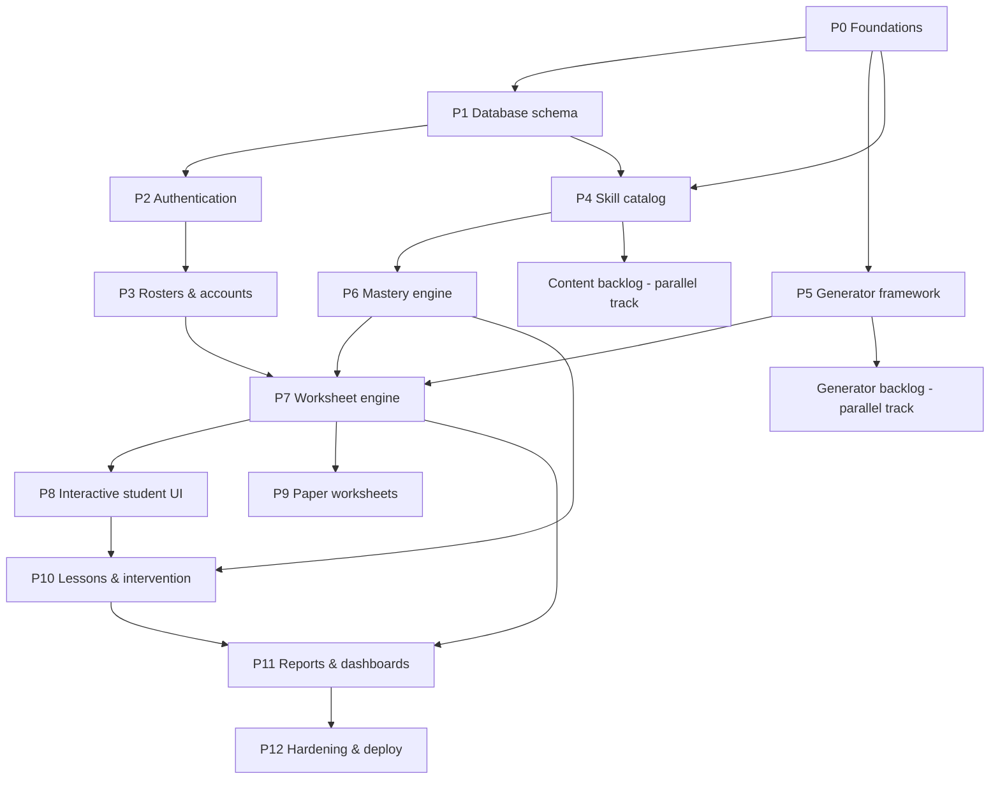

# MathScript: Implementation Plan

An adaptive math practice platform for children, built around the Common Core skill hierarchy.

- **Teachers** manage classes of students and track the progress of everyone in them.
- **Parents** are linked to one or more children. A child can have several parents. Parents see progress reports.
- **Students** log in with a **class code + student code** (no password) and work through interactive worksheets.
- **Worksheets** are generated programmatically, either **by skill** or **adaptively** from each child's estimated level. They can be **interactive** or **paper + answer key**.
- Mastered skills come back periodically for **spaced review**.
- Each skill has a short **lesson**. A student who keeps getting a skill wrong is shown the lesson, and if that doesn't help, the skill is **flagged for teacher intervention**.

---

## 1. Technology choices

Everything is TypeScript, so a junior developer only needs to learn one language, and the problem generators can be shared between server and browser.

| Concern | Choice | Why |
|---|---|---|
| Repo layout | **pnpm workspaces monorepo** | One repo, shared types, one CI |
| Frontend | **React + Vite + React Router + TanStack Query** | Most common stack; fast dev server; TanStack Query handles caching and loading states |
| Styling | **Tailwind CSS** | Common, little custom CSS to maintain |
| Math rendering | **KaTeX** | Fast, renders fractions and expressions |
| Backend | **Node.js + Fastify** | Common, fast, simple plugin model |
| Validation | **Zod**, with schemas shared by web and api | One definition for request/response shapes |
| Database | **PostgreSQL 16** | Standard relational DB; good at recursive queries for the skill graph |
| ORM / migrations | **Prisma** | Easiest migrations and typed queries for juniors |
| Auth | **Cookie sessions stored in Postgres, argon2 password hashing** | Simpler and safer than JWTs for a first-party web app |
| Tests | **Vitest** (unit/integration), **Playwright** (end-to-end) | Fast, same API everywhere |
| Logging | **pino** (built into Fastify) | Structured logs |
| Local dev | **Docker Compose** for Postgres | One command to start |
| CI | **GitHub Actions** | Lint, typecheck, test on every PR |
| Deploy | **Docker images** on any container host | Not tied to a vendor |

### Repository layout

```
mathscript/
  apps/
    api/            Fastify server, Prisma schema, routes, services
    web/            React app (teacher, parent, and student UIs)
  packages/
    shared/         Zod schemas, types, seeded RNG, answer checkers
    generators/     One problem generator per skill (pure functions, no DB)
    curriculum/     Skill catalog data (standards, skills, prerequisites) and lessons
  docs/             Architecture decisions, how-to guides
  docker-compose.yml
```

### Key design decisions (read before starting)

1. **Generators are pure, seeded functions.** `generate(seed, difficulty)` always returns the same problem for the same inputs. A worksheet stores its seeds, so the answer key can always be recreated and bugs can be reproduced.
2. **Problems are snapshotted.** When a worksheet is created, each generated problem (prompt and answer) is saved to the DB. Changing a generator later never changes an already-assigned worksheet.
3. **Answers never go to the student's browser.** The API strips answers before sending problems to students and checks every answer on the server.
4. **Two structures describe skills.** The **tree** (Domain → Cluster → Standard → Skill) is for display. The **prerequisite graph**, which skill must be mastered before which, drives adaptivity.
5. **The mastery logic is pure functions with config constants.** It is easy to unit-test and to tune without touching the DB.

---

## 2. Data model (target state)

```
users              id, email (unique), password_hash, role [teacher|parent|admin], display_name, created_at
sessions           id, user_id?, student_id?, expires_at, created_at
classes            id, name, grade_level, class_code (unique, 6 chars), created_at, archived_at
class_teachers     class_id, user_id                       (lets a class have co-teachers later)
students           id, first_name, last_initial, grade_level, created_at
enrollments        class_id, student_id, student_code      UNIQUE(class_id, student_code)
parent_students    parent_user_id, student_id              (many-to-many)
parent_invites     id, student_id, code (unique), created_by, expires_at, redeemed_by?, redeemed_at?

standards          id, code ("3.OA.A.1"), grade, domain, cluster, description
skills             id, slug ("add-within-10"), standard_id, name, grade, sort_order, generator_key, status [active|pending]
skill_prereqs      skill_id, prereq_skill_id
lessons            id, skill_id, content_md, example_seed, version

student_skill_state  student_id, skill_id, status [not_started|learning|mastered|needs_review],
                     mastery_score (0..1), attempts, correct, wrong_streak,
                     last_practiced_at, mastered_at, next_review_at, review_interval_days, lesson_viewed_at
worksheets         id, mode [interactive|paper], source [skill|adaptive|placement], seed,
                   student_id, class_id?, created_by_user_id?, status [assigned|in_progress|completed], created_at, completed_at
worksheet_items    id, worksheet_id, position, skill_id, generator_key, generator_version,
                   seed, difficulty, is_review, problem_json (snapshot incl. answer)
attempts           id, worksheet_item_id, student_id, skill_id, response_json, is_correct,
                   time_ms, source [interactive|paper], created_at
flags              id, student_id, skill_id, reason, status [open|acknowledged|resolved],
                   note?, created_at, resolved_by_user_id?, resolved_at
```

---

## 3. Mastery and adaptivity rules (v1)

All numbers live in one config file (`packages/shared/src/mastery-config.ts`) so they can be tuned later.

- **Mastery score.** An exponentially weighted moving average: `score = score + 0.3 × (correct ? 1 − score : 0 − score)`, starting at 0.
- **Mastered** when `score ≥ 0.85` **and** `attempts ≥ 8`.
- **Spaced review.** When a skill becomes mastered, set `next_review_at = now + 2 days`.
  - A correct review doubles the interval, up to a cap of 60 days.
  - A wrong review lowers the score. If the score drops below 0.70, the status becomes `needs_review`, the skill re-enters the practice pool, and the interval resets.
- **Struggle detection:**
  - 3 wrong in a row on a skill → show that skill's lesson and record `lesson_viewed_at`.
  - After the lesson has been shown, 3 more wrong out of the next 5 attempts, **or** accuracy under 50% across the last 10 attempts spread over at least 2 days → **open a flag** for the teacher. Only one open flag per student and skill.
- **Frontier skills.** Not mastered, and every prerequisite mastered. These are the student's estimated level.
- **Adaptive worksheet mix** (default 10 problems):
  - 70% frontier skills, at most 3 different skills, lowest grade and sort order first
  - 20% reviews that are due
  - 10% warm-ups from recently mastered skills
  - If any bucket is short, its slots go to the frontier.
- **Difficulty within a skill.** 1–3, picked from the mastery score: under 0.4 → 1, under 0.7 → 2, otherwise 3.

---

## 4. How to use this plan

- Each task has an **ID**, its **dependencies**, **what to do**, and **done when** (acceptance criteria).
- **Start a task only when everything it depends on is merged.**
- Tasks marked ⭐ deserve review from a senior developer: security, core algorithms, or schema.
- Tasks marked 📚 are content tasks. They are best done with a teacher or curriculum expert.
- **Definition of Done for every task:**
  - a PR with tests
  - lint and typecheck pass
  - CI is green
  - at least one reviewer approves
  - docs are updated if behavior changed

### Phase dependency overview



### Milestones (vertical slices)

| Milestone | Goal | Tasks |
|---|---|---|
| **M1 Skeleton** | Repo, CI, DB, hello world | P0 |
| **M2 Accounts** | Teachers create classes, students log in, parents link | P1 (users/roster), P2, P3 |
| **M3 First playable** | A teacher assigns a skill worksheet, a student completes it | P4 (5 skills), P5 + 5 generators, P7.1, P7.3–P7.7, P8 |
| **M4 Adaptive** | Mastery tracking, adaptive worksheets, spaced review | P6, P7.2, P7.8 |
| **M5 Paper** | Printable worksheets, answer keys, paper score entry | P9 |
| **M6 Intervention** | Lessons, flags, teacher inbox | P10 |
| **M7 Reporting** | Student, class, and parent reports | P11 |
| **M8 Launch-ready** | E2E tests, security, deploy | P12 |

The generator and content backlogs (G-tasks, C-tasks) run **in parallel from M3 onward** and are ideal for onboarding new developers.

---

## 5. Tasks

### Phase 0: Foundations

**T0.1 Create monorepo skeleton**
- Depends on: none
- Do:
  - `git init`
  - pnpm workspaces with `apps/api`, `apps/web`, `packages/shared`, `packages/generators`, `packages/curriculum`
  - a root `tsconfig.base.json` (strict mode)
  - `.editorconfig`, `.gitignore`, `.nvmrc` (Node LTS)
  - a README with setup steps
- Done when: `pnpm install` works, and each package has a `package.json` and a placeholder `src/index.ts`.

**T0.2 Linting and formatting**
- Depends on: T0.1
- Do: ESLint (typescript-eslint) and Prettier at the root, plus `pnpm lint`, `pnpm format`, and `pnpm typecheck` scripts.
- Done when: all three scripts pass on a clean repo.

**T0.3 Local Postgres via Docker Compose**
- Depends on: T0.1
- Do:
  - a `docker-compose.yml` with Postgres 16 and a named volume
  - `.env.example` with `DATABASE_URL`
  - document `docker compose up -d` in the README
- Done when: a developer can connect with `psql` using the documented URL.

**T0.4 API hello world**
- Depends on: T0.1, T0.3
- Do:
  - a Fastify app in `apps/api`
  - env loading validated with Zod: the app fails fast on missing vars
  - a `GET /health` route returning `{ ok: true }`
  - a `pnpm --filter api dev` script with watch mode (tsx)
- Done when: `curl localhost:3000/health` returns `{ ok: true }`.

**T0.5 Web hello world**
- Depends on: T0.1, T0.4
- Do:
  - a Vite + React + TS app in `apps/web` with React Router and Tailwind
  - the Vite dev proxy sends `/api` to the API
  - a home page that shows the `/health` result using TanStack Query
- Done when: the page shows "API OK".

**T0.6 Test harness**
- Depends on: T0.2
- Do: add Vitest to every package, write one sample test each, and add a root `pnpm test`.
- Done when: `pnpm test` runs all packages.

**T0.7 Continuous integration**
- Depends on: T0.3, T0.6
- Do: a GitHub Actions workflow that runs install, lint, typecheck, and test on each PR, with a Postgres service container.
- Done when: a PR shows green checks.

**T0.8 Prisma setup and test DB helper** ⭐
- Depends on: T0.4
- Do:
  - install Prisma in `apps/api` and create the first migration
  - scripts: `db:migrate`, `db:reset`, `db:seed`
  - a test helper that runs integration tests against a separate test database and truncates tables between tests
  - a Fastify plugin that exposes `app.db`
- Done when: an integration test can insert and read a row, and running it twice is clean.

**T0.9 Error handling and logging basics**
- Depends on: T0.4, T0.5
- Do:
  - API: a standard error response shape `{ error: { code, message } }`, request IDs in logs, and Zod validation errors mapped to 400
  - Web: a top-level error boundary and a `fetch` wrapper that sends cookies and throws typed errors
- Done when: a bad request returns the standard shape, and the web shows a friendly error page.

---

### Phase 1: Database schema

Each task adds Prisma models, a migration, and a small integration test proving that constraints work.

**T1.1 Users table** ⭐
- Depends on: T0.8
- Do: a `users` table with a role enum (teacher, parent, admin) and a unique, lowercased email.
- Done when: a test shows a duplicate email is rejected.

**T1.2 Classes, students, and enrollments** ⭐
- Depends on: T1.1
- Do: create `classes`, `class_teachers`, `students`, and `enrollments`, with these constraints:
  - `UNIQUE(class_code)`
  - `UNIQUE(class_id, student_code)`
- Done when: tests cover both unique constraints and cascade rules (archiving a class does not delete students).

**T1.3 Parent links and invites**
- Depends on: T1.2
- Do: create `parent_students` (composite primary key) and `parent_invites`.
- Done when: a test links two parents to one student and one parent to two students.

**T1.4 Standards, skills, and prerequisites** ⭐
- Depends on: T0.8
- Do: create `standards`, `skills`, and `skill_prereqs`, with indexes on `skills.grade` and `skills.standard_id`.
- Done when: the migration applies and the models are queryable.

**T1.5 Lessons table**
- Depends on: T1.4
- Do: create the `lessons` table (one active lesson per skill).
- Done when: the migration applies.

**T1.6 Student skill state**
- Depends on: T1.2, T1.4
- Do: create `student_skill_state` with primary key `(student_id, skill_id)` and an index on `(student_id, next_review_at)`.
- Done when: the migration applies.

**T1.7 Worksheets, items, and attempts** ⭐
- Depends on: T1.2, T1.4
- Do: create the three tables, with an index on `attempts(student_id, skill_id, created_at)` for the struggle queries.
- Done when: the migration applies and a test inserts a worksheet with items and attempts.

**T1.8 Flags**
- Depends on: T1.2, T1.4
- Do: create the `flags` table with a partial unique index so a student and skill can have only one `open` flag.
- Done when: a test shows a second open flag is rejected.

**T1.9 Development seed script**
- Depends on: T1.3
- Do: `db:seed` creates:
  - 1 teacher and 1 parent (with known dev passwords)
  - 1 class with 5 students
  - the parent linked to 2 of those students
- Done when: `pnpm db:reset && pnpm db:seed` works and the README lists the dev logins.

---

### Phase 2: Authentication

**T2.1 Password hashing utility**
- Depends on: T0.4
- Do: `hashPassword` and `verifyPassword` using argon2id.
- Done when: tests show a correct password verifies, a wrong one fails, and hashes differ for the same input.

**T2.2 Session plugin** ⭐
- Depends on: T1.1, T0.8
- Do:
  - add a `sessions` table
  - a Fastify plugin that reads a signed httpOnly cookie (`Secure` in production, `SameSite=Lax`, 7-day expiry for adults, 1 day for students) and decorates `request.auth` as `{ kind: 'user', user } | { kind: 'student', student, classId } | null`
- Done when: tests cover a valid session, an expired session, and a tampered cookie.

**T2.3 Teacher and parent registration**
- Depends on: T2.1, T2.2
- Do:
  - `POST /api/auth/register` with `{ email, password, displayName, role: 'teacher'|'parent' }`
  - Zod validation (password ≥ 10 chars)
  - creates a session on success
- Done when: tests cover success, a duplicate email, and a weak password.

**T2.4 Login, logout, and current user**
- Depends on: T2.3
- Do:
  - `POST /api/auth/login`, `POST /api/auth/logout`, `GET /api/auth/me`
  - login returns the same error for an unknown email and a wrong password
- Done when: tests cover each route.

**T2.5 Student login** ⭐
- Depends on: T2.2, T1.2
- Do:
  - `POST /api/auth/student-login` with `{ classCode, studentCode }`
  - codes are case-insensitive
  - fails if the class is archived
  - creates a student session
- Done when: tests cover success, a wrong code, and an archived class.

**T2.6 Authorization helpers** ⭐ (most important security task)
- Depends on: T2.4, T2.5, T1.3
- Do: in `apps/api/src/auth/permissions.ts`:
  - `requireRole(...roles)`
  - `canAccessStudent(auth, studentId)`: allowed for a teacher of any class the student is enrolled in, a linked parent, or the student themself
  - `canManageClass(auth, classId)`
  - Fastify `preHandler` wrappers for the above
- Done when: a table-driven test covers every role × relationship combination, including "teacher of a different class" and "parent of a different child".

**T2.7 Login rate limiting**
- Depends on: T2.4, T2.5
- Do: `@fastify/rate-limit` on the auth routes: 10 per minute per IP for adults, and a stricter limit per class code for student login to stop code guessing.
- Done when: a test shows the 11th request returns 429.

**T2.8 Web: auth context and protected routes**
- Depends on: T0.9, T2.4
- Do:
  - `useAuth()` hook backed by `/api/auth/me`
  - `<RequireRole role="teacher">` route wrapper
  - redirect to the correct login page when signed out
- Done when: visiting `/teacher` signed out redirects to login.

**T2.9 Web: teacher and parent login and register pages**
- Depends on: T2.8
- Do: forms with validation messages that redirect to the role's home page after login.
- Done when: the seeded teacher and parent can log in and out.

**T2.10 Web: student login page**
- Depends on: T2.8, T2.5
- Do:
  - a kid-friendly page with large inputs and a big button
  - remembers the class code on the device (localStorage, wrapped in try/catch)
- Done when: a seeded student can log in on a tablet-sized viewport.

---

### Phase 3: Rosters and accounts

**T3.1 API: class create, read, update, archive**
- Depends on: T2.6
- Do:
  - `POST/GET/PATCH /api/classes`, plus `POST /api/classes/:id/archive`
  - class code generator: 6 characters from an unambiguous alphabet (no 0/O/1/I/L), retried on collision
- Done when: a teacher sees only their own classes, and the code generator has a unit test.

**T3.2 API: manage students in a class**
- Depends on: T3.1
- Do:
  - add, edit, and remove (unenroll) students
  - auto-generate a 4-digit student code unique within the class, or let the teacher choose one
  - store first name and last initial only (data minimization)
- Done when: tests cover a duplicate code and a teacher from another class getting 403.

**T3.3 API: bulk add students**
- Depends on: T3.2
- Do: `POST /api/classes/:id/students/bulk` accepts a list of names, one per line, and creates every student in a single transaction.
- Done when: a 30-name paste creates 30 students with unique codes.

**T3.4 API: parent invites**
- Depends on: T3.2, T2.4, T1.3
- Do:
  - A teacher creates an invite for a student. The code is 8 characters and expires after 14 days.
  - A logged-in parent redeems it with `POST /api/parent/invites/redeem` to create the link.
  - A code can be used once. A student can have several parents.
- Done when: tests cover an expired code, a reused code, and two parents redeeming separate invites for the same child.

**T3.5 API: list endpoints**
- Depends on: T3.4
- Do: `GET /api/parent/children` and `GET /api/classes/:id/students`.
- Done when: tests show each role sees only what it should.

**T3.6 Web: teacher class list**
- Depends on: T3.1, T2.9
- Do: list the teacher's classes and show a create-class form.
- Done when: the teacher can create a class and see its code.

**T3.7 Web: class roster page**
- Depends on: T3.2, T3.3, T3.6
- Do:
  - a table of students with their codes
  - add, edit, and remove students; a bulk-add textarea
  - a "Print login cards" view with one card per student showing the class code and student code
- Done when: roster management works end to end.

**T3.8 Web: parent invite flow**
- Depends on: T3.4, T3.7
- Do: a teacher "Invite parent" button that shows a printable code, and a parent "Add child" page to redeem it.
- Done when: the parent sees the child after redeeming.

**T3.9 Web: parent home**
- Depends on: T3.5, T3.8
- Do: a card for each linked child. Progress details come in P11.
- Done when: a parent with two children sees two cards.

---

### Phase 4: Skill catalog

**T4.1 Catalog format and documentation** ⭐
- Depends on: T0.1
- Do: `packages/curriculum/catalog/*.yaml`, one file per grade, with an entry shape like:
  ```yaml
  - slug: add-within-10
    standard: K.OA.A.5
    name: Add within 10
    sortOrder: 10
    generator: add-within-10
    prerequisites: [count-to-10]
  ```
  Also write a doc, `docs/curriculum.md`, explaining how to add a skill. Standards get their own `standards.yaml` file.
- Done when: the format is documented, with an example of 3 skills.

**T4.2 Catalog loader and validator** ⭐
- Depends on: T4.1
- Do: a function that parses the YAML into typed objects and checks:
  - slugs are unique
  - every prerequisite and standard exists
  - the prerequisite graph has **no cycles** (topological sort)
- Done when: tests with deliberately broken fixtures fail with clear messages, and CI runs the validator.

**T4.3 Sync catalog to database**
- Depends on: T4.2, T1.4
- Do: a `pnpm catalog:sync` script that upserts standards, skills, and prerequisites idempotently, and marks skills removed from the files as inactive. It never deletes them, because attempts reference them.
- Done when: running it twice makes no changes the second time.

**T4.4 API: skill endpoints**
- Depends on: T4.3, T2.6
- Do:
  - `GET /api/skills?grade=3` returns the tree Domain → Cluster → Standard → Skill
  - `GET /api/skills/:id` returns the skill with its prerequisites
- Done when: the tree is ordered correctly.

**T4.5 Web: skill browser component**
- Depends on: T4.4
- Do: a reusable collapsible tree with a grade selector and checkboxes in "select" mode. It is reused for picking worksheet skills and for reports.
- Done when: it appears in Storybook or on a demo page with the seeded catalog.

📚 **Content backlog C1–C6.** Each depends on T4.2 and can run in parallel. Cross-grade prerequisites mean C(n) should land after C(n−1).
- **C1** Kindergarten: Counting & Cardinality, Operations & Algebraic Thinking, Number & Operations in Base Ten
- **C2** Grade 1
- **C3** Grade 2
- **C4** Grade 3
- **C5** Grade 4
- **C6** Grade 5

Grades 6–8 are a later phase if they are in scope.

Done when, for each: the validator passes, and every skill either names a generator or is marked `status: pending`. **For M3, author only 5 skills from C1 first.**

---

### Phase 5: Generator framework

**T5.1 Seeded random number utility**
- Depends on: T0.6
- Do: in `packages/shared`:
  - a `createRng(seed)` function (mulberry32) with helpers `int(min,max)`, `pick(arr)`, `shuffle(arr)`, `bool(p)`
  - `deriveSeed(parentSeed, index)` for per-item seeds
- Done when: tests show the same seed always gives the same sequence.

**T5.2 Generator interface and registry** ⭐
- Depends on: T5.1
- Do: define these types:
  ```ts
  interface Generator {
    key: string; version: number;
    generate(opts: { seed: number; difficulty: 1 | 2 | 3 }): Problem;
  }
  interface Problem {
    prompt: PromptPart[];          // text | math (KaTeX) | visual (typed SVG spec)
    answer: AnswerSpec;            // e.g. { type: 'integer', value: 7 }
    explanation?: PromptPart[];    // shown after a wrong answer
  }
  ```
  Add a registry `getGenerator(key)` and `listGenerators()`.
- Done when: the types compile, and the registry has a unit test using a dummy generator.

**T5.3 Answer types and checkers** ⭐
- Depends on: T5.2
- Do: `checkAnswer(spec, rawResponse)` supporting these answer types:
  - integer
  - decimal
  - fraction (with an option to require simplest form)
  - multiple-choice
  - comparison (`<`, `>`, `=`)
  - ordered list of numbers

  Normalize the input first: trim whitespace, strip commas ("1,000"), and parse "3/4".
- Done when: there is a table-driven test with at least 40 cases.

**T5.4 Prompt parts and visual specs**
- Depends on: T5.2
- Do: define Zod schemas for `PromptPart`. Visuals are **data**, not markup. For example, `{ kind: 'clock', hour: 3, minute: 15 }` and `{ kind: 'fractionBar', parts: 4, shaded: 3 }`. The web app renders them.
- Done when: the schemas are exported and tested.

**T5.5 Generator test kit**
- Depends on: T5.3
- Do: `testGenerator(gen, constraints)` runs 500 seeds per difficulty and asserts:
  - the output is deterministic
  - the stored answer passes its own checker
  - the prompt is valid per the T5.4 schemas
  - no more than 10% duplicates in a 10-problem set
  - optional constraints hold (for example "answer ≤ 10")
- Done when: it is used in T5.6.

**T5.6 Reference generator: "Add within 10"**
- Depends on: T5.5
- Do: implement it with heavy comments, as the example every later generator copies. Difficulty 1 = sums ≤ 5, 2 = ≤ 10, 3 = missing addend (`3 + ? = 8`).
- Done when: it passes the test kit, and `docs/writing-a-generator.md` walks through it.

**T5.7 Catalog ↔ registry check**
- Depends on: T5.6, T4.2
- Do: extend the validator so every `active` skill's `generator` key exists in the registry.
- Done when: CI fails if a skill references a missing generator.

**T5.8 Multiple-choice distractor helper**
- Depends on: T5.3
- Do: `makeDistractors(correct, strategies, rng)` with strategies such as off-by-one, operation swap, and forgot-to-regroup. It guarantees unique options and never repeats the correct answer.
- Done when: tests pass.

**T5.9 Word-problem templates**
- Depends on: T5.2
- Do: a small template system with lists of names and objects and correct pluralization ("1 apple" / "3 apples"). Use neutral, diverse names.
- Done when: tests pass.

**T5.10 Web: problem renderer**
- Depends on: T5.4, T0.5
- Do: a `<ProblemView problem>` component that renders text, KaTeX, and visual parts. Unknown visual kinds show a placeholder.
- Done when: it renders the T5.6 output.

**T5.11 Visual components.** Each one is its own small task. All depend on T5.10.
- a) Countable objects (groups of icons)
- b) Number line
- c) Ten-frame and base-10 blocks
- d) Fraction bar and fraction circle
- e) Analog clock
- f) Coins
- g) Arrays (rows × columns of dots)
- h) Rectangle with labeled sides (area/perimeter)

Done when: each is an SVG component with props matching its T5.4 spec, readable in light and print modes.

**T5.12 Dev-only generator playground page**
- Depends on: T5.10
- Do: `/dev/generators` lets a developer pick a generator, seed, and difficulty, then shows the problem and answer. "Next seed" button.
- Done when: it is available only in development builds.

🔧 **Generator backlog G-tasks** (one task per skill). Each depends on T5.6 and on any visual component it needs. A typical task: implement it, register it, pass the test kit, and check it in the playground. Suggested order, matching the content backlog:
- **G1** Counting objects (needs T5.11a)
- **G2** Compare numbers (`<`, `>`, `=`)
- **G3** Add/subtract within 20
- **G4** Place value (tens/ones, then hundreds; uses T5.11c)
- **G5** 2-digit addition without regrouping, then with regrouping
- **G6** Subtraction with and without regrouping
- **G7** Skip counting
- **G8** Telling time (T5.11e)
- **G9** Money (T5.11f)
- **G10** Multiplication facts (T5.11g for arrays at difficulty 1)
- **G11** Division facts
- **G12** Multi-digit multiplication
- **G13** Long division with remainders
- **G14** Identify fractions (T5.11d)
- **G15** Equivalent fractions
- **G16** Compare fractions
- **G17** Add/subtract like denominators
- **G18** Decimals: read/write, compare, add
- **G19** Area and perimeter (T5.11h)
- **G20** One-step word problems (T5.9) for each operation

---

### Phase 6: Mastery engine

These are pure functions in `packages/shared/src/mastery/`, with no DB access, except T6.5.

**T6.1 Mastery config**
- Depends on: T1.6
- Do: put every threshold from section 3 into `mastery-config.ts`, with a comment explaining each one.
- Done when: the values are exported and documented.

**T6.2 `updateSkillState(state, attempt, now)`** ⭐
- Depends on: T6.1
- Do: update the score, counts, wrong streak, and last-practiced time, and apply the status transitions (not_started → learning → mastered → needs_review → learning).
- Done when: table-driven tests cover every transition and edge case (the first attempt, exactly at the threshold).

**T6.3 Spaced-review scheduling**
- Depends on: T6.2
- Do: add the `next_review_at` and interval logic from section 3, applied only to attempts that are reviews.
- Done when: tests with a fake clock simulate 3 months of reviews.

**T6.4 Struggle detection** ⭐
- Depends on: T6.2
- Do: `detectStruggle(state, recentAttempts, now)` returns `{ showLesson: boolean, raiseFlag: boolean, reason?: string }`, following section 3.
- Done when: tests cover each trigger and confirm it doesn't fire twice.

**T6.5 Attempt recording service** ⭐
- Depends on: T6.3, T6.4, T1.7, T1.8
- Do: `recordAttempt(db, { item, response, timeMs, source })`, all in one transaction:
  1. check the answer
  2. insert the attempt
  3. load or create the skill state and update it
  4. run struggle detection
  5. create a flag if needed

  It returns `{ isCorrect, correctAnswer, explanation, showLesson }`.
- Done when: integration tests cover a correct answer, a wrong one, the lesson trigger, and the flag trigger.

**T6.6 Frontier calculation**
- Depends on: T6.2, T4.3
- Do: `getFrontierSkills(states, catalog, gradeLevel)` returns skills that are not mastered and whose prerequisites are all mastered, ordered by grade and sort order. If none qualify, it returns the first skills of the student's grade.
- Done when: unit tests run on a small fixture graph.

**T6.7 Due-review query**
- Depends on: T6.3
- Do: `getDueReviews(db, studentId, now, limit)`, ordered by most overdue first.
- Done when: an integration test passes.

**T6.8 Placement worksheet** (can be deferred until after M4)
- Depends on: T6.6, T7.3
- Do: for a new student, build a 15–20 problem placement worksheet that samples key skills from the grade below through the current grade.
  - A correct answer on a skill infers mastery of its prerequisites (walk the graph).
  - Store the source as `placement`.
- Done when: a new student finishes placement, and their frontier matches the expected fixture.

---

### Phase 7: Worksheet engine

**T7.1 Skill-mode builder**
- Depends on: T5.2, T1.7
- Do: `buildSkillWorksheet({ skillIds, count, difficulty, seed })` returns item specs. Each item gets `deriveSeed(seed, i)`, and the items are spread evenly across the chosen skills and then shuffled.
- Done when: unit tests show the output is deterministic and evenly distributed.

**T7.2 Adaptive builder** ⭐
- Depends on: T6.6, T6.7, T7.1
- Do: `buildAdaptiveWorksheet({ states, catalog, now, count, seed })` uses the 70/20/10 mix and fallbacks from section 3, interleaves the items so review problems are not bunched together, and marks `is_review`.
- Done when: tests cover a new student (all frontier), a student with many due reviews, and a student who has mastered everything.

**T7.3 API: create worksheet**
- Depends on: T7.1, T7.2, T2.6
- Do: `POST /api/worksheets`:
  - **Teacher:** `{ mode, source, skillIds?, count, studentIds | classId }` creates **one worksheet per student**, each with its own seed so neighbours get different problems.
  - **Student:** `POST /api/me/practice` creates an adaptive interactive worksheet.
  - Generate the problems and save snapshots in `problem_json`.
- Done when: integration tests pass for both roles.

**T7.4 API: get worksheet (student view)** ⭐
- Depends on: T7.3
- Do: `GET /api/me/worksheets/:id` returns the items with **answers and explanations stripped**, plus any responses already recorded.
- Done when: a test serializes the response and asserts that no `answer` field exists anywhere in it.

**T7.5 API: submit answer**
- Depends on: T7.4, T6.5
- Do: `POST /api/me/worksheets/:id/items/:itemId/answer` with `{ response, timeMs }` calls T6.5.
  - One attempt per item. A resubmit returns 409.
  - Moves the worksheet status to `in_progress`.
- Done when: integration tests pass, including the 409 case.

**T7.6 API: complete worksheet and summary**
- Depends on: T7.5
- Do: on completion, mark the worksheet completed and return a summary: score, per-skill results, and skills that became mastered.
- Done when: the summary numbers are verified in tests.

**T7.7 API: assignment lists**
- Depends on: T7.3
- Do: `GET /api/me/worksheets` returns a student's assigned and in-progress worksheets, and `GET /api/classes/:id/worksheets` returns the teacher's view with per-student status.
- Done when: integration tests pass.

**T7.8 Adaptive difficulty**
- Depends on: T7.2
- Do: choose each item's difficulty from the skill's mastery score (section 3).
- Done when: unit tests pass.

**T7.9 Web: teacher "Create worksheet" page**
- Depends on: T7.3, T4.5
- Do:
  - choose students or the whole class
  - choose mode (interactive or paper) and source (pick skills with the skill browser, or adaptive)
  - choose the count
- Done when: the teacher assigns a worksheet and students see it.

---

### Phase 8: Interactive student UI

**T8.1 Student home**
- Depends on: T7.7, T2.10
- Do: big cards for assigned worksheets, a large "Practice" button that starts an adaptive worksheet, and the student's first name.
- Done when: it works on a tablet viewport.

**T8.2 Answer input components**
- Depends on: T5.3, T5.10
- Do: one input per answer type:
  - an on-screen number pad, for tablets
  - a fraction input (numerator over denominator)
  - multiple-choice buttons
  - `<` `=` `>` buttons
- Done when: each input is shown on the demo page and works by keyboard and touch.

**T8.3 Worksheet player**
- Depends on: T8.2, T7.5
- Do:
  - one problem at a time, with a progress bar
  - submit, then show a correct or try-again message with the explanation
  - resumes at the first unanswered item after a reload
- Done when: a student completes a 10-item worksheet end to end.

**T8.4 Completion screen**
- Depends on: T8.3, T7.6
- Do: a celebration, the score, and a "skills mastered" message.
- Done when: it shows the T7.6 summary.

**T8.5 Accessibility and kid-friendly design pass**
- Depends on: T8.3
- Do: touch targets of at least 48px, high contrast, a "read aloud" button using the Web Speech API, and no time pressure shown.
- Done when: an axe/Lighthouse accessibility score ≥ 95 on player pages.

---

### Phase 9: Paper worksheets

**T9.1 Printable worksheet page**
- Depends on: T5.10, T7.3
- Do: `/print/worksheets/:id`, a print-CSS layout with:
  - name and date lines
  - a 2-column numbered problem grid with answer space
  - a short worksheet code in the footer, for entering results later

  A batch view `/print/batch/:batchId` prints a whole class with page breaks.
- Done when: the browser print preview looks clean on Letter and A4.

**T9.2 Answer key page**
- Depends on: T9.1
- Do: `/print/worksheets/:id/key` shows the same layout with answers filled in. Teachers and linked parents only; the API returns answers only to them.
- Done when: a student session gets 403.

**T9.3 Parent: generate paper practice**
- Depends on: T9.2, T4.5
- Do: a parent can create a paper worksheet for their child, by skill or adaptive, and print it with its key.
- Done when: the flow works end to end.

**T9.4 Paper results entry**
- Depends on: T9.2, T6.5
- Do: a teacher or parent enters the worksheet code (or opens it from a list) and marks each item ✓ or ✗ on one screen. Each mark is recorded through T6.5 with `source = paper`, so paper work feeds mastery too.
- Done when: entering results updates the skill state.

**T9.5 Server-side PDF export** (optional)
- Depends on: T9.2
- Do: an endpoint that renders the print pages to PDF with Playwright, for one-click class batch downloads.
- Done when: a PDF of 30 worksheets downloads in under 15 seconds.

---

### Phase 10: Lessons and intervention

**T10.1 Lesson format**
- Depends on: T1.5, T5.4
- Do:
  - lessons live in `packages/curriculum/lessons/<skill-slug>.md`
  - Markdown with a short explanation, an optional visual block, and **worked examples generated live** from the skill's own generator with fixed seeds, so the examples always match the practice problems
  - a sync script loads them into the DB
- Done when: the format is documented and has one sample lesson.

**T10.2 API and web: lesson viewer**
- Depends on: T10.1
- Do: `GET /api/skills/:id/lesson`, and a `<LessonView>` component with a step-by-step worked example.
- Done when: the sample lesson renders.

**T10.3 Lesson trigger in the player**
- Depends on: T10.2, T8.3, T6.4
- Do: when T7.5 returns `showLesson`, open the lesson in a friendly modal ("Let's review!"), record `lesson_viewed_at`, then continue the worksheet. Students can also open the lesson themselves with a "Help" button.
- Done when: 3 wrong answers in a row open the lesson.

**T10.4 API: teacher flags**
- Depends on: T6.5, T2.6
- Do: `GET /api/classes/:id/flags?status=open`, plus `POST /api/flags/:id/acknowledge` and `POST /api/flags/:id/resolve` with an optional note. A flag includes the student's recent wrong answers so the teacher can see the mistake pattern.
- Done when: integration tests pass.

**T10.5 Web: teacher flag inbox**
- Depends on: T10.4
- Do: an inbox page, a count badge in the nav, and a flag detail showing recent wrong answers next to the correct ones. One-click "Assign easier practice" creates a skill-mode worksheet at difficulty 1.
- Done when: a teacher can work a flag through to resolved.

📚 **Lesson content backlog L-tasks.** One task per skill group, matching the G-tasks. Each depends on T10.1 and on the skill's generator. Done when: the lesson renders and has been reviewed by a teacher.

---

### Phase 11: Reports and dashboards

**T11.1 API: student progress report**
- Depends on: T6.5, T4.4
- Do: `GET /api/students/:id/progress` returns each skill's status, accuracy, attempts, and last-practiced time, grouped by domain, plus summary counts. It uses `canAccessStudent`, so it works for teachers, parents, and the student.
- Done when: integration tests pass for each role.

**T11.2 API: student activity history**
- Depends on: T7.6
- Do: a paginated list of completed worksheets with scores, plus weekly totals of problems and accuracy for charts.
- Done when: integration tests pass.

**T11.3 API: class overview** ⭐ (performance)
- Depends on: T11.1
- Do: `GET /api/classes/:id/overview?grade=&domain=` returns a students × skills matrix of statuses, built in **one aggregated query**, not one per student.
- Done when: it returns 30 students × 100 skills in under 200ms on seeded data.

**T11.4 Web: student report page**
- Depends on: T11.1, T11.2
- Do: shared by the teacher and parent views: summary tiles, skills by domain with status colors, and an accuracy-over-time chart.
- Done when: a teacher and a parent can both open it for the same child.

**T11.5 Web: skill map view**
- Depends on: T11.4, T4.5
- Do: the T4.5 skill browser with each skill colored by status (not started, learning, mastered, needs review, flagged), with a legend.
- Done when: the map renders seeded progress correctly.

**T11.6 Web: class heatmap**
- Depends on: T11.3
- Do: a grid of students × skills with grade and domain filters, sticky headers, and cells that click through to the student's skill detail.
- Done when: it handles 30 × 100 smoothly.

**T11.7 Web: teacher dashboard**
- Depends on: T11.6, T10.5
- Do: open flags, worksheets due or in progress, "students who haven't practiced in 7 days", and class-wide weakest skills.
- Done when: it shows all four with seeded data.

**T11.8 Web: parent dashboard**
- Depends on: T11.4, T3.9
- Do: each child's card gains this week's practice, recently mastered skills, and skills to work on, plus a "Print practice" shortcut to T9.3.
- Done when: it shows seeded data.

**T11.9 Printable progress report**
- Depends on: T11.4
- Do: a print-CSS version of the student report for parent-teacher conferences.
- Done when: it prints cleanly on 1–2 pages.

---

### Phase 12: Hardening and deploy

**T12.1 End-to-end tests (Playwright)**
- Depends on: T11.7, T11.8
- Do: cover the full flow, run in CI:
  1. the teacher registers, creates a class, and adds students
  2. the teacher assigns a worksheet
  3. a student logs in and completes it
  4. the teacher sees progress
  5. a parent redeems an invite and sees the report

  Add a second test for "3 wrong answers → lesson → more wrong answers → teacher sees the flag".
- Done when: both pass in CI.

**T12.2 Security pass** ⭐
- Depends on: T12.1
- Do:
  - `@fastify/helmet` headers
  - an Origin check on state-changing requests (CSRF)
  - an **automated test that hits every route as every role** and compares the results to an expected permission table
  - confirm no answers leak to student sessions
  - confirm no student PII beyond first name and last initial
- Done when: there is a checklist in `docs/security.md` and all tests pass.

**T12.3 Password reset**
- Depends on: T2.4
- Do: email a one-time token that expires in 30 minutes, using a pluggable email sender (console in dev, SMTP/provider in prod).
- Done when: integration tests pass.

**T12.4 Performance and load test**
- Depends on: T7.5, T11.3
- Do: a k6 script simulating 100 classes × 30 students answering at the same time. Add any missing indexes.
- Done when: p95 answer-submit latency is under 150ms at that load.

**T12.5 Production Docker images**
- Depends on: T0.7
- Do: a multi-stage Dockerfile for the API and a static build of the web app (served by the API or by nginx). Migrations run as a separate step on deploy.
- Done when: `docker compose -f docker-compose.prod.yml up` runs the whole stack.

**T12.6 Staging deploy and backups**
- Depends on: T12.5
- Do: deploy to the chosen host, manage secrets, and set up nightly Postgres backups and a tested restore.
- Done when: staging is reachable and one restore drill is documented.

**T12.7 Privacy and compliance review** (non-developer)
- Depends on: T12.2
- Do: review COPPA/FERPA obligations, the data retention policy, parent consent for linking, and a data deletion request process with the stakeholders.
- Done when: the decisions are recorded in `docs/privacy.md`.

---

## 6. Suggested team flow

- **Weeks 1–2:** P0 and P1. One developer takes P5 (T5.1–T5.6) in parallel, because it has no DB dependency.
- **Weeks 3–4:** P2 and P3 (accounts). C1 content and the first 5 G-tasks proceed in parallel.
- **Weeks 5–6:** P7 skill mode and P8 complete **M3 (first playable)**. Demo it to a teacher for feedback.
- **Weeks 7–8:** P6 and the adaptive parts of P7 complete **M4**.
- **Weeks 9–12:** P9, P10, and P11 can be split between developers. The G, C, and L backlogs continue in parallel.
- **Weeks 13+:** P12, then the remaining content.

Good first tasks for brand-new developers: G-tasks (after T5.6), T5.11 visual components, T3.6, and T8.4. Each is self-contained with clear acceptance criteria.

---

## 7. Open questions for the product owner

1. **Grade scope for v1.** K–5 is assumed. Are 6–8 or high school needed?
2. **Retries.** Can a student retry a wrong item, or is it one attempt per item? One attempt is assumed; mastery math is simpler.
3. **Co-teachers and schools.** Is there a school or district admin level? The schema supports co-teachers, but no UI is planned yet.
4. **Student login security.** Codes alone can be guessed in principle. Is it acceptable, or should teachers be able to "open" login windows or use per-student picture passwords?
5. **Hosting target and budget.** This affects T12.5 and T12.6.
6. **Parent notifications.** Should parents get email digests or flag notices? Not planned yet.
